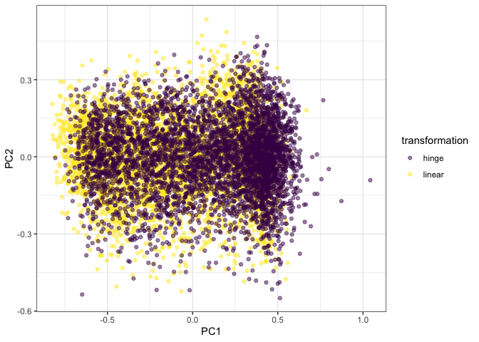
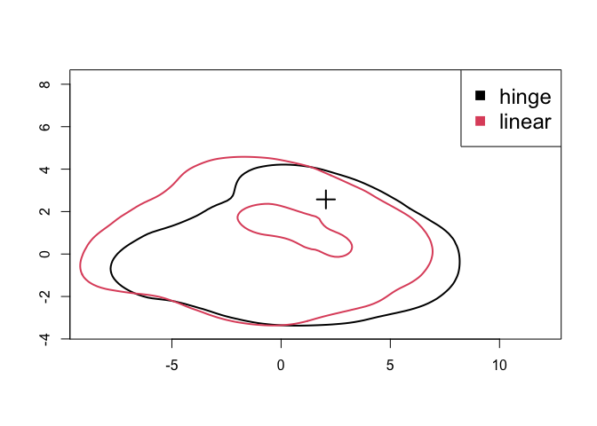
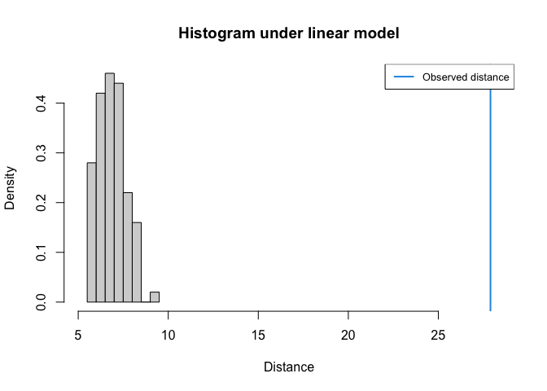
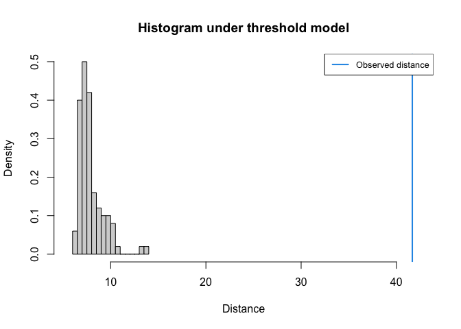

ABC Analysis
================

# Approximate Bayesian Computation Analysis

## Setup

``` r
library(tidyverse)
library(abc)
library(here)
```

``` r
# read in sumstats
## iheringii
### Simulations
lin_ihe_paths <- list.files(here("analysis", "output", "simulations"), pattern = "linear", full.names = TRUE)
lin_ihe <- map_df(lin_ihe_paths, read_csv) %>% 
  mutate(transformation = "linear")

hinge_ihe <- read_csv(here("analysis", "output", "simulations", "sims_2023-11-20_hinge.csv")) %>% 
  mutate(transformation = "hinge")

sims_ihe <- bind_rows(lin_ihe, hinge_ihe) %>% 
  # fill in the missing param values
  group_by(param_id) %>% 
  fill(ancestral_n, total_inds_curr) %>% 
  fill(ancestral_n, total_inds_curr, .direction = "up") %>% 
  ungroup()
  

### Empirical
empirical_ihe <- read_csv(here("analysis", "output", "empirical_sumstats", "iheringii_sumstats.csv")) %>% 
  dplyr::select(-num_var)

## catenatus
```

## Exploration

### PCA

#### *E. iheringii*

``` r
pca_df_ihe <- sims_ihe %>% 
  dplyr::select(
    starts_with("sfs"),
    "taj_d",
    starts_with("pi"),
    starts_with("ibd"),
    "morans_i"
  )

pca_ihe <- prcomp(pca_df_ihe, center=TRUE, scale. = FALSE)

pca_df_ihe <- bind_cols(pca_ihe$x, sims_ihe)

ggplot(pca_df_ihe, aes(x = PC1, y = PC2, color = transformation)) +
  geom_point(alpha = 0.5) +
  scale_color_viridis_d() +
  theme_bw()
```



## ABC

### Model Selection

#### *E. iheringii*

Model selection to assess discriminatory ability among simulations.

``` r
sumstats_ihe <- sims_ihe %>% 
  dplyr::select(
    starts_with("sfs"),
    "taj_d",
    starts_with("pi"),
    starts_with("ibd"),
    "morans_i"
  )

cv_modsel_ihe <- cv4postpr(sims_ihe$transformation, sumstats_ihe, nval = 500, tol = 0.05, method="mnlogistic")

summary(cv_modsel_ihe)
```

    Confusion matrix based on 500 samples for each model.

    $tol0.05
           hinge linear
    hinge    358    142
    linear   112    388


    Mean model posterior probabilities (mnlogistic)

    $tol0.05
            hinge linear
    hinge  0.6753 0.3247
    linear 0.2942 0.7058

Model selection using the empirical data and a rejection algorithm.

``` r
modsel_emp_ihe <- postpr(empirical_ihe, sims_ihe$transformation, sumstats_ihe, tol=.05, method="mnlogistic")

summary(modsel_emp_ihe)
```

    Call: 
    postpr(target = empirical_ihe, index = sims_ihe$transformation, 
        sumstat = sumstats_ihe, tol = 0.05, method = "mnlogistic")
    Data:
     postpr.out$values (451 posterior samples)
    Models a priori:
     hinge, linear
    Models a posteriori:
     hinge, linear

    Warning: Posterior model probabilities are corrected for unequal number of
    simulations per models.


    Proportion of accepted simulations (rejection):
     hinge linear 
    0.3156 0.6844 

    Bayes factors:
            hinge linear
    hinge  1.0000 0.4595
    linear 2.1761 1.0000


    Posterior model probabilities (mnlogistic):
     hinge linear 
         1      0 

    Bayes factors:
           hinge linear
    hinge      1      1
    linear     1      1

### Goodness-of-fit

#### *E. iheringii*

PCA

``` r
gfitpca(empirical_ihe, sumstat=sumstats_ihe, index=sims_ihe$transformation, cprob=.1)
```



Goodness-of-fit test linear.

``` r
ss_lin_ihe <- bind_cols(sumstats_ihe, transformation = sims_ihe$transformation) %>% 
  filter(transformation == "linear") %>% 
  dplyr::select(-transformation)

gof_linear <- gfit(target=empirical_ihe, sumstat=ss_lin_ihe, statistic=mean, tol = 0.05, nb.replicate=100)

plot(gof_linear, main="Histogram under linear model")
```



Goodness-of-fit test hinge.

``` r
ss_hinge_ihe <- bind_cols(sumstats_ihe, transformation = sims_ihe$transformation) %>% 
  filter(transformation == "hinge") %>% 
  dplyr::select(-transformation)

gof_hinge <- gfit(target=empirical_ihe, sumstat=ss_hinge_ihe, statistic=mean, tol = 0.05, nb.replicate=100)

plot(gof_hinge, main="Histogram under threshold model")
```



Empirical summary statistics

``` r
empirical_ihe %>% knitr::kable(digits = 3)
```

| sfs_h1 | sfs_h2 | sfs_h3 |    pi |  taj_d | pi_pop_2704 | pi_pop_2821 | pi_pop_2825 | pi_pop_2833 | pi_pop_2924 | pi_pop_2925 | pi_pop_2937 | pi_pop_3039 | pi_pop_3135 | pi_pop_3139 | pi_pop_3146 | pi_pop_3152 | pi_pop_3252 | pi_pop_3357 | pi_pop_3800 | pi_pop_3902 | pi_pop_3913 | pi_pop_4111 | pi_pop_4114 | pi_pop_4227 | pi_pop_4237 | pi_pop_4670 | pi_pop_4671 | pi_pop_4892 | pi_pop_5000 | pi_pop_6527 | pi_pop_8725 | pi_pop_10257 | ibd_r2 | ibd_slope | morans_i |
|-------:|-------:|-------:|------:|-------:|------------:|------------:|------------:|------------:|------------:|------------:|------------:|------------:|------------:|------------:|------------:|------------:|------------:|------------:|------------:|------------:|------------:|------------:|------------:|------------:|------------:|------------:|------------:|------------:|------------:|------------:|------------:|-------------:|-------:|----------:|---------:|
|  0.311 |   0.19 |  0.157 | 0.157 | -0.688 |       0.105 |       0.078 |       0.132 |       0.067 |       0.053 |       0.049 |       0.127 |       0.107 |       0.089 |       0.074 |       0.085 |        0.08 |       0.139 |        0.09 |        0.09 |        0.07 |       0.091 |       0.066 |        0.05 |       0.104 |       0.064 |       0.108 |        0.09 |       0.095 |        0.06 |       0.038 |       0.061 |        0.043 |  0.031 |     0.007 |    0.116 |
