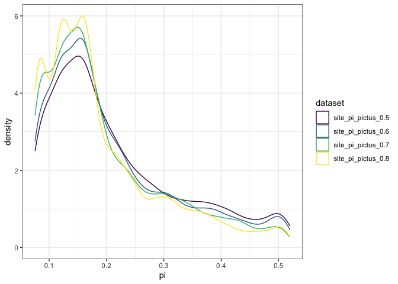
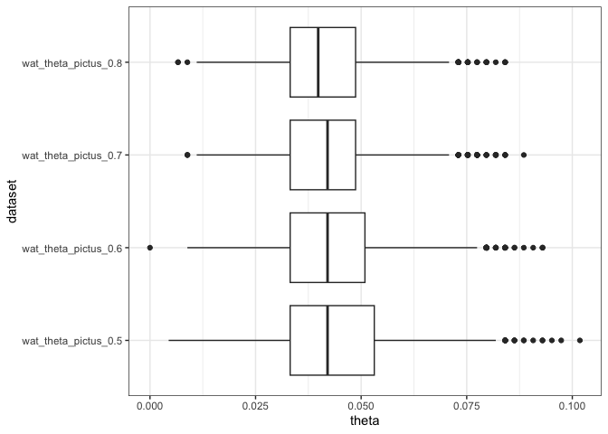
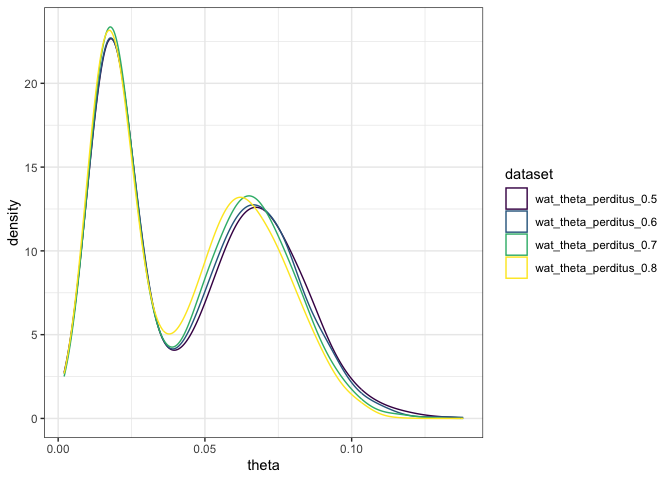

Single population summary statistics
================

I’m creating per-species plots of the single population summary
statistics calculated for four coverage thresholds: 0.5, 0.6, 0.7, and
0.8. I’m seeing if these differ across missingness thresholds for each
species to see how missing data impact genetic diversity estimates. In
addition, I can get a quick idea of genetic diversity variation across
species.

<div class="panel-tabset">

## E. catenatus

### number of sites

``` r
cat_num_sites <- num_sites %>% 
  filter(species == "catenatus")

ggplot(cat_num_sites, aes(x = dataset, y = num_sites)) +
  geom_col() +
  theme_bw() +
  theme(axis.text.x = element_text(angle = 45, hjust = 1))
```


### per-site pi

``` r
cat_site_pi <- site_pi %>% 
  filter(species == "catenatus")

ggplot(cat_site_pi, aes(x = pi, color = dataset)) + 
  geom_density() +
  scale_color_viridis_d() + 
  theme_bw()
```


### per-ind pi

``` r
cat_ind_names <- names(ind_lists) %>% 
  str_detect("catenatus") %>% 
  keep(ind_lists, .) %>% 
  pluck(1)


cat_ind_pi <- names(ind_pi) %>% 
  str_detect("catenatus") %>% 
  keep(ind_pi, .)

for (i in 1:length(cat_ind_pi)){
  rownames(cat_ind_pi[[i]]) <- cat_ind_names
  colnames(cat_ind_pi[[i]]) <- cat_ind_names
  heatmap(cat_ind_pi[[i]], main = names(cat_ind_pi)[i])
}
```


### Watterson’s theta

``` r
cat_wat_theta <- wat_theta %>% 
  filter(species == "catenatus")

ggplot(cat_wat_theta, aes(x = theta, color = dataset)) + 
  geom_density() +
  scale_color_viridis_d() + 
  theme_bw()
```


``` r
ggplot(cat_wat_theta, aes(x = theta, y = dataset)) +
  geom_boxplot() +
  theme_bw()
```


### Tajima’s D

``` r
cat_taj_d <- taj_d %>% 
  filter(species == "catenatus")

ggplot(cat_taj_d, aes(x = d, color = dataset)) + 
  geom_density() +
  scale_color_viridis_d() + 
  theme_bw()
```


``` r
ggplot(cat_taj_d, aes(x = d, y = dataset)) +
  geom_boxplot() +
  theme_bw()
```


### SFS

``` r
cat_sfs <- sfs %>% 
  filter(species == "catenatus")

ggplot(cat_sfs, aes(x = rank, y = count, color = dataset)) +
  geom_line() +
  scale_color_viridis_d() +
  theme_bw() 
```


## E. pictus

### number of sites

``` r
pic_num_sites <- num_sites %>% 
  filter(species == "pictus")

ggplot(pic_num_sites, aes(x = dataset, y = num_sites)) +
  geom_col() +
  theme_bw() +
  theme(axis.text.x = element_text(angle = 45, hjust = 1))
```


### per-site pi

``` r
pic_site_pi <- site_pi %>% 
  filter(species == "pictus")

ggplot(pic_site_pi, aes(x = pi, color = dataset)) + 
  geom_density() +
  scale_color_viridis_d() + 
  theme_bw()
```



### per-ind pi

``` r
pic_ind_names <- names(ind_lists) %>% 
  str_detect("pictus") %>% 
  keep(ind_lists, .) %>% 
  pluck(1)


pic_ind_pi <- names(ind_pi) %>% 
  str_detect("pictus") %>% 
  keep(ind_pi, .)

for (i in 1:length(pic_ind_pi)){
  rownames(pic_ind_pi[[i]]) <- pic_ind_names
  colnames(pic_ind_pi[[i]]) <- pic_ind_names
  heatmap(pic_ind_pi[[i]], main = names(pic_ind_pi)[i])
}
```


### Watterson’s theta

``` r
pic_wat_theta <- wat_theta %>% 
  filter(species == "pictus")

ggplot(pic_wat_theta, aes(x = theta, color = dataset)) + 
  geom_density() +
  scale_color_viridis_d() + 
  theme_bw()
```


``` r
ggplot(pic_wat_theta, aes(x = theta, y = dataset)) +
  geom_boxplot() +
  theme_bw()
```



### Tajima’s D

``` r
pic_taj_d <- taj_d %>% 
  filter(species == "pictus")

ggplot(pic_taj_d, aes(x = d, color = dataset)) + 
  geom_density() +
  scale_color_viridis_d() + 
  theme_bw()
```


``` r
ggplot(pic_taj_d, aes(x = d, y = dataset)) +
  geom_boxplot() +
  theme_bw()
```


### SFS

``` r
pic_sfs <- sfs %>% 
  filter(species == "pictus")

ggplot(pic_sfs, aes(x = rank, y = count, color = dataset)) +
  geom_line() +
  scale_color_viridis_d() +
  theme_bw() 
```


## E. perditus

### number of sites

``` r
per_num_sites <- num_sites %>% 
  filter(species == "perditus")

ggplot(per_num_sites, aes(x = dataset, y = num_sites)) +
  geom_col() +
  theme_bw() +
  theme(axis.text.x = element_text(angle = 45, hjust = 1))
```


### per-site pi

``` r
per_site_pi <- site_pi %>% 
  filter(species == "perditus")

ggplot(per_site_pi, aes(x = pi, color = dataset)) + 
  geom_density() +
  scale_color_viridis_d() + 
  theme_bw()
```


### per-ind pi

``` r
per_ind_names <- names(ind_lists) %>% 
  str_detect("perditus") %>% 
  keep(ind_lists, .) %>% 
  pluck(1)


per_ind_pi <- names(ind_pi) %>% 
  str_detect("perditus") %>% 
  keep(ind_pi, .)

for (i in 1:length(per_ind_pi)){
  rownames(per_ind_pi[[i]]) <- per_ind_names
  colnames(per_ind_pi[[i]]) <- per_ind_names
  heatmap(per_ind_pi[[i]], main = names(per_ind_pi)[i])
}
```


### Watterson’s theta

``` r
per_wat_theta <- wat_theta %>% 
  filter(species == "perditus")

ggplot(per_wat_theta, aes(x = theta, color = dataset)) + 
  geom_density() +
  scale_color_viridis_d() + 
  theme_bw()
```



``` r
ggplot(per_wat_theta, aes(x = theta, y = dataset)) +
  geom_boxplot() +
  theme_bw()
```


### Tajima’s D

``` r
per_taj_d <- taj_d %>% 
  filter(species == "perditus")

ggplot(per_taj_d, aes(x = d, color = dataset)) + 
  geom_density() +
  scale_color_viridis_d() + 
  theme_bw()
```


``` r
ggplot(per_taj_d, aes(x = d, y = dataset)) +
  geom_boxplot() +
  theme_bw()
```


### SFS

``` r
per_sfs <- sfs %>% 
  filter(species == "perditus")

ggplot(per_sfs, aes(x = rank, y = count, color = dataset)) +
  geom_line() +
  scale_color_viridis_d() +
  theme_bw() 
```


## E. iheringii

### number of sites

``` r
ihe_num_sites <- num_sites %>% 
  filter(species == "iheringii")

ggplot(ihe_num_sites, aes(x = dataset, y = num_sites)) +
  geom_col() +
  theme_bw() +
  theme(axis.text.x = element_text(angle = 45, hjust = 1))
```


### per-site pi

``` r
ihe_site_pi <- site_pi %>% 
  filter(species == "iheringii")

ggplot(ihe_site_pi, aes(x = pi, color = dataset)) + 
  geom_density() +
  scale_color_viridis_d() + 
  theme_bw()
```


### per-ind pi

``` r
ihe_ind_names <- names(ind_lists) %>% 
  str_detect("iheringii") %>% 
  keep(ind_lists, .) %>% 
  pluck(1)


ihe_ind_pi <- names(ind_pi) %>% 
  str_detect("iheringii") %>% 
  keep(ind_pi, .)

for (i in 1:length(ihe_ind_pi)){
  rownames(ihe_ind_pi[[i]]) <- ihe_ind_names
  colnames(ihe_ind_pi[[i]]) <- ihe_ind_names
  heatmap(ihe_ind_pi[[i]], main = names(ihe_ind_pi)[i])
}
```


### Watterson’s theta

``` r
ihe_wat_theta <- wat_theta %>% 
  filter(species == "iheringii")

ggplot(ihe_wat_theta, aes(x = theta, color = dataset)) + 
  geom_density() +
  scale_color_viridis_d() + 
  theme_bw()
```


``` r
ggplot(ihe_wat_theta, aes(x = theta, y = dataset)) +
  geom_boxplot() +
  theme_bw()
```


### Tajima’s D

``` r
ihe_taj_d <- taj_d %>% 
  filter(species == "iheringii")

ggplot(ihe_taj_d, aes(x = d, color = dataset)) + 
  geom_density() +
  scale_color_viridis_d() + 
  theme_bw()
```


``` r
ggplot(ihe_taj_d, aes(x = d, y = dataset)) +
  geom_boxplot() +
  theme_bw()
```


### SFS

``` r
ihe_sfs <- sfs %>% 
  filter(species == "iheringii")

ggplot(ihe_sfs, aes(x = rank, y = count, color = dataset)) +
  geom_line() +
  scale_color_viridis_d() +
  theme_bw() 
```


</div>
